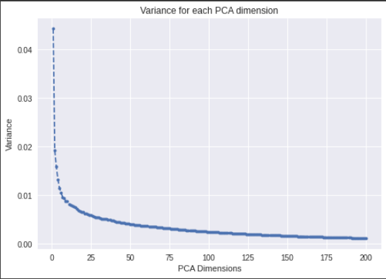

# Image Search Engine using Deep Learning Model (ResNet50)

We have seen different reverse image search engine like Google Image Search, Pinterest, where image is provide to find out other similar images. So, Exactly in this project we are going to build that.

We are using Resnet50 for features extraction and nearest neighbors algorithm to find out similar neighbors  based on its each Euclidean distance.

Dataset we used is Caltech101 where there is 101 categories of images.

## Tools Used
* Pretrained Model : ResNet50
* Framework: Tensorflow 2.0
* Web Framework: Flask
* Extra Library: Scikit-learn

## Steps for Reverse Image Search
1. (Training-Step) Extract All image features of Caltech 101 using Resnet50 and save with pickle, so that we can use that later for similar image finding. The ResNet-50 model generated 2,048 features from the provided
image. Each feature is a floating-point value between 0 and 1. This means we each image features are represented by vector of size 2048.

2. Train a K nearest-neighbors model using the brute-force algorithm to find the nearest `n` neighbors based on Euclidean distance. Training a nearest-neighbor is instantaneous because at training time there isn't much processing i.e lazy learning. Note that in this project, training occur only once when server starts.

3. Upload New Image -> Compute Features using ResNet50.
4. Search with the already trained nearest neighbor model which gives us `n` nearest images based on its Euclidean distance with its features.
5. Return the `n` similar images

## Instruction
* run notebook `data_download` which download datasets and trained-models.
* placed dataset inside static folder as: static/datasets/caltech101/*
* Run server.py
 
## Output


Note: To increase number of similar images just change `no_of_results_send` in server.py

## Visualizing Image Cluster using t-SNE
* First we need to reduce the dimensions of the feature
vectors because it’s not possible to plot a 2,048-dimension vector
(the feature-length) in two dimensions (the paper). The t-distributed
stochastic neighbor embedding (t-SNE) algorithm reduces the
high-dimensional feature vector to 2D, providing a bird’s-eye view
of the dataset, which is helpful in recognizing clusters and nearby
images. t-SNE is difficult to scale to large datasets, so it is a good
idea to reduce the dimensionality using Principal Component
Analysis (PCA) and then call t-SNE.

```python
# Perform PCA over the features
num_feature_dimensions=100 # Set the number of features
pca = PCA(n_components = num_feature_dimensions)
pca.fit(featureList)
feature_list_compressed = pca.transform(featureList)
# For speed and clarity, we'll analyze about first half of the dataset.
selected_features = feature_list_compressed[:4000]
selected_class_ids = class_ids[:4000]
selected_filenames = filenames[:4000]
tsne_results =
TSNE(n_components=2,verbose=1,metric='euclidean').fit_transform(selected_features)
# Plot a scatter plot from the generated t-SNE results
colormap = plt.cm.get_cmap('coolwarm')
scatter_plot = plt.scatter(tsne_results[:,0],tsne_results[:,1], c =
selected_class_ids, cmap=colormap)
plt.colorbar(scatter_plot)
plt.show()
```
# How to Improve Speed on Image Search
Either by reduce feature-length or use better algorithm to search among features. 


As, ResNet-50 model gives 2048 features of one image.
If each feature = 32-bit floating point then, 
Each image with 2048 features = 32*2048 ~ 8KB.

If there are million images then total features size ~ 8GB i.e pretty slow.
So, we use PCA to reduce dimension of features from 2048 -> 100.
We choose 100 as a dimension which can be sufficient to represent image features by analysing scree-plot.
    

For example, after the first 100 dimensions, the additional dimensions don’t add much variance (almost equal to 0) and can be neglected. Without even checking the accuracy it is safe to assume that the PCA with 100 dimensions will be a good for accurate prediction.

```python
num_feature_dimensions = 100
pca = PCA(n_components=num_feature_dimensions)
pca.fit(feature_list)
feature_list_compressed = pca.transform(feature_list)

n_image_search = 8
neighbors = NearestNeighbors(n_neighbors=n_image_search,
                             algorithm='brute',
                             metric='euclidean').fit(feature_list_compressed)
```

So, Reducing feature length i.e dimensionality reduction with PCA is important.
With PCA, each Image feature now is represented by only 100 vector size.
One image = 32 * 100 ~ 0.4 KB. (If each feature = 32-bit floating point)
For one million Images = 0.4 * 10^6 = 50 KB i.e pretty fast.

Obivously, there is trade off to choose PCA dimension is complexity and accuracy. When we take minimum dimension, we loss many features can result to even less accuracy. So, good dimension is find out by elbow in **Scree Plot**.

So, that's why we increase speed of image search by dimensionality reduction. Also, By reducing the distance calculation to the most
important features, we can also improve the result accuracy
slightly.


